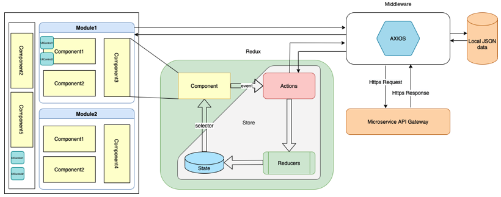

# react-boilerplate-client-side-rendering
Client Side Rendering Production Ready Boilerplate(Template)

This project is a React JS boilerplate that can be used to kickstart a production ready web application.

The boilerplate provides **an optimized module based architecture for building solid web applications** through **Container-View** - design pattern which is used in this architecture.

```
If you love this boilerplate, give us a star :)
```

### Container-View design pattern
* Container/View pattern (also known as Presentational/Container, Smart/Dumb) is a technique of splitting components into 'Containers' which are responsible for any stateful logic and data fetching and 'Views' which are responsible for data presentation.
* It used to increase the reusability of views

### Boilerplate Architecture

<div align="center">
    
</div>

#### Module:
* All the various modules like Claim, PDM, Team Workload etc are module.
* Each module consists of container, component and slice, container consist of index.js file which exports the module container as a default module which makes the screen available as a functional component.
#### Component:
* Component hold UIControl and other common components too to display data, capture user event.
#### UIControl:
* UIControls like buttons, checkbox, dropdown etc.
* It can be reused in components to increase code reusability hence increase development speed
#### Redux:
* If any event occurs from component, it dispatches action. Events like fetch data, button press, filter data etc.
* If action is of async/thunk(Asynchronous) type then it will go to middleware to fetch data otherwise it directly go to Reducer.
* After getting the payload(data) from successful async, it updates its state immutably, by making copies of the parts of the state that need to change and only modify those copies.
* By using selector component will get data from store, if data changes UI re-renders.
#### Middleware:
* Depending on type of request it calls api using AXIOS library or the data which is available in JSON file.

### Pre-requisites
- Node.js (v14.x)
- NPM (v6.x)

## Quick start
After cloning this repo run command from your project directory
```
npm i 
```

## Available Scripts

In the project directory, you can run:
```
npm start
```

Runs the app in the development mode.<br />
Open [http://localhost:3000](http://localhost:3000) to view it in the browser.

The page will reload if you make edits.<br /> You will also see any lint errors in the console.

```
npm run build:development
```
Builds the app for development to the `build` folder.<br /> It correctly bundles app in development mode and optimizes the build but contain debug information.

The build is minified and the filenames include the hashes.<br /> Your app is ready to be deployed in develpment mode!

```
npm run build:production
```

Builds the app for production to the `build` folder.<br /> It correctly bundles app in production mode and optimizes the build for the best performance.

The build is minified and the filenames include the hashes.<br /> Your app is ready to be deployed!

To serve the app from build folder use following commands

```
npm install -g serve
```
```
serve -s build -l 4000
```
-l in serve is use to change the port number while service app from build folder

## Folder structure (How to structure your code)

### assets
* All the static assets reside here.
* Each asset should be registered and exported from the /index.js
* Thus, all assets will be accessible and imported from ‘/assets’
* This can include but not limited to images, logos, vector icons, fonts, etc.

### components
* Only shared components used across modules are placed here.
* All the components should be registered and exported from /index.js for a single access point.

### modules
* All the various modules like home, about etc are defined here.
* Each module consist of container, component and slice, container consist of index.js file which exports the module container as a default module which makes the screen available as a functional component.
* Component directory hold all the component that are required by only this module.
* Slice directory contain redux slice and backend/service api.
* All data requests api/json file path are defined here, and response data is transformed and served. In some cases, it can also be saved in the redux store.
* The components may dispatch actions, read the store and update themselves based on the data changes. They may access the services directly if it doesn’t need to be added to the redux store.

### ui-controls
* It holds all the UI controls which is required to build components
* UI control like: drawer, bottom-sheet, checkbox, dropdown etc.

### router
* It contains, all the routing logic.
* Our app uses “react-router-dom” for routing implementation.
* Mainly 2 types of routes are included, public & private, where private being the ones that require authentication.
* “PrivatRoute.js” is a component to add a check for user authentication for secure/private routes.

### redux
* “react-redux, redux-persist, @reduxjs/toolkit, redux-logger” is being used to manage the state of application. It is a single source of truth, it means that the only way to change data in UI is to dispatch redux action which will change state within redux reducer
* This is the central state of the application. This incorporates all the mapping between reducer, store, persist and middle-wares.
* It combines all the “slice” present in all the “modules”
* A “slice” combines the action(synchronous), thunkAction(asynchronous), reducer, selector, initial state of application.
* thunkActions will use modules/…/slice/…Action.js for backend connectivity. Thunk is a redux middleware used to handle asynchronous actions and side-effects.
* “redux-persist” is used to persist data locally in device across user session.
* State describes the condition of the app at a specific point in time 
* The UI is rendered based on state
* When something happens (such as a user clicking a button), the state is updated based on what occurred
* The UI re-renders based on the new state

### services
* Services are to manage all api requests. You can see them as a bridge or an adapter between the database server APIs and the view layer (pages and components) of our application.
* It will take care of all the network calls of our app.
* It also holds service worker and web vital•	

### styles
* This module holds our application-level styles.
* It can include theme definition (font, colours, typography) of the app UI, and global or commonly used styles.

### jsconfig.json
* It defines have used it only to define the base directory for all imports.
* This way when we require a shared component inside a view of a page, we don’t have to type a relative path like ‘../../components/SharedComp.js’
* We can simply use ‘components/SharedComp.js’ from anywhere in the project


## License

This project is released under the [GNU License](LICENSE).

## About us
